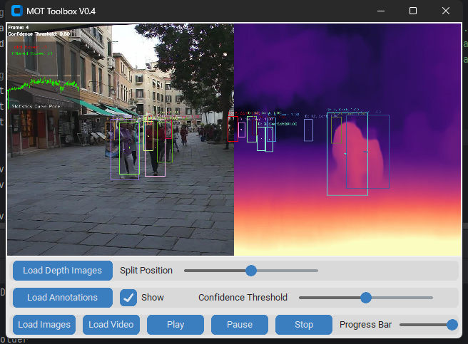

# MOT-Toolbox
This is a simple toolbox for MOT.



# 
```markdown
project/
│
├── main.py              # Main Program Entry
├── video_player.py      # Video Player Module
├── modules/             # Function Module Directory
│   ├── __init__.py      # Module Directory Initialization Files
│   ├── base_module.py   # Base Module Class
│   ├── video_overlay.py # Video Split Screen Module
│   ├── video_annotation.py # Video Annotation Module
│
├── config.json          # Configuration File
└── annotations/         # Annotation Files Directory
    └── example.txt
